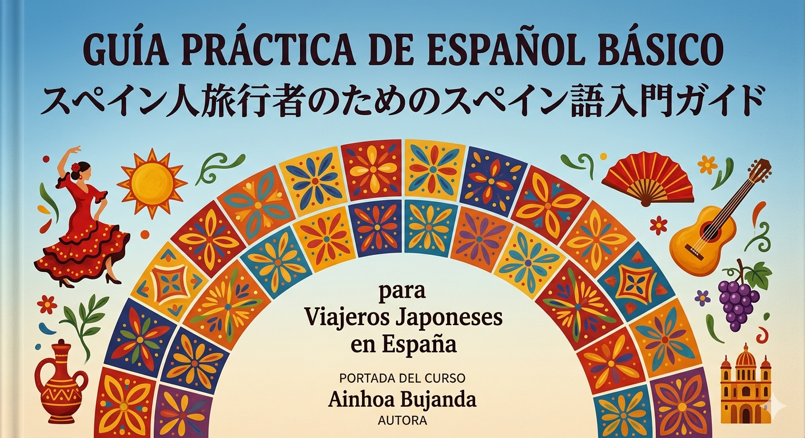

# Guía práctica de español básico para viajeros japoneses en España

## Presentación del curso

Este curso está dirigido a viajeros japoneses adultos con nivel inicial de español que desean comunicarse en situaciones básicas durante un viaje a España.

El curso se organiza en diferentes materiales digitales creados con herramientas trabajadas en la asignatura Producción de Materiales Educativos Digitales.

## Objetivo general

Desarrollar la capacidad de los estudiantes para comunicarse de forma básica y autónoma en situaciones cotidianas de viaje: aeropuerto, alojamiento, restaurante y pequeñas interacciones sociales.

## Estructura del curso

1. [Presentación del curso](01-presentacion-curso/)
2. [Conversaciones cotidianas en español](02-conversaciones-cotidianas/)
3. [Guía práctica en EPUB y PDF](03-guia-viajeros-epub-pdf/)
4. [Presentación interactiva con reveal.js](04-presentacion-reveal/)
5. [Cuestionario IMS QTI](05-cuestionario-qti/)
6. [Actividad SCORM](06-scorm-espanol-viajar/)
7. [Narrativa interactiva con Twine](07-twine-recupera-maleta/)
8. [Narrativa interactiva con RenPy](08-renpy-bar-cortesia/)
9. [Autoevaluación según UNE 71362](09-autoevaluacion-une71362/)
10. [Conclusiones](10-conclusiones/)

## Herramientas utilizadas

- Markdown
- GitHub Pages
- Pandoc
- reveal.js
- Twine
- RenPy
- eXeLearning / SCORM
- ONYX IMS QTI
- Genially o HTML interactivo

## Autora

Ainhoa Bujanda